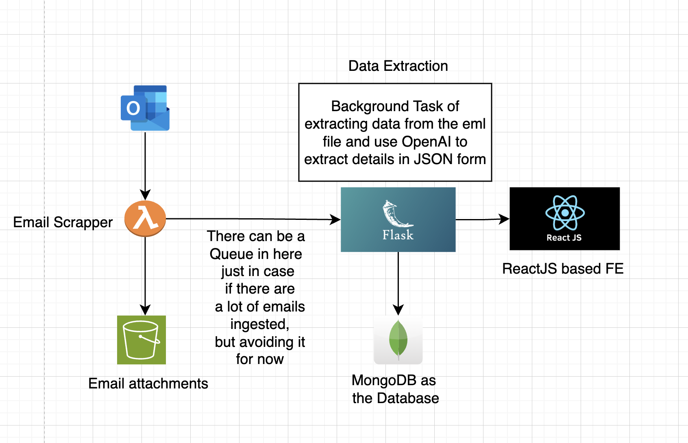
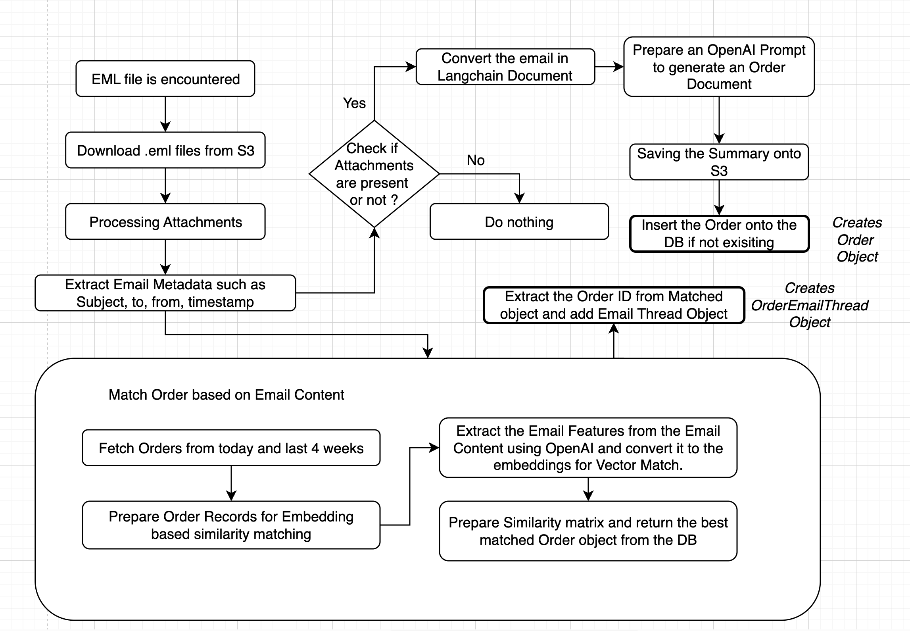
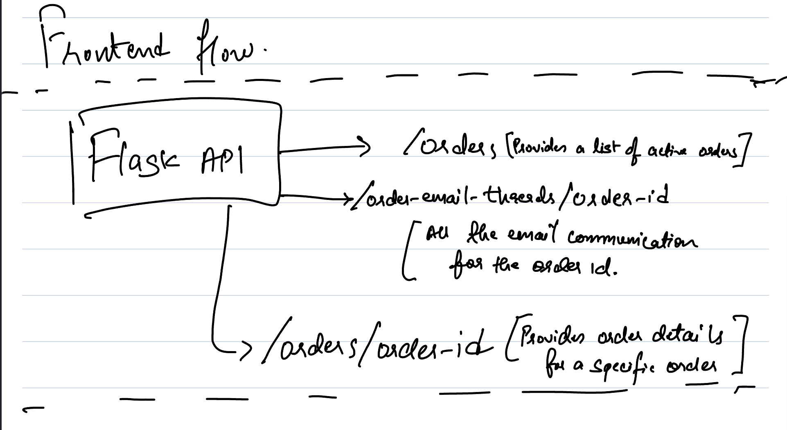

# Lighthouz AI Task

## Modules

- Some directories were used for initial testing rather than direct implementation on the APIs such as:
  - `openai-langchain`
  - `outlook-emails`
  - `data-extractor`
- `email-processor-lambda` Lambda to process Emails from Outlook.
- `matching-poc` Code Snippets for Matching logic.
- `mock-emails` contains the scripts for generating dummy invoices with `faker` for testing.
- `backend` - Flask Based API Webserver
- `frontend` - ReactJS based frontend [I've used JS instead of Typescript since it was a task]

## Requirements Covered

- [ ] Lambda: Fetch Emails from Outlook and store the `.eml` files from Outlook APIs
- [x] Flask: Backend API to fetch the `.eml` files from S3 and process it using LangChain and extract info using OpenAI.
- [x] Flask: Store Details about the Order and Email threads in MongoDB.
- [x] Flask: GET APIs for fetching the Orders and Order Email Threads
- [x] React: Page for Listing all the Active Orders with relevant Details.
- [x] React: Page for Listing the specific Order details alongwith Email Threads.
- [ ] Deploy everything on Cloud for testing.

## Matching Logic

- Assuming that first email would have the Order Invoice in it, which creates a base record.
- So, considering any email from the second conversation, assuming that each order's lifespan is at most 4 weeks, fetch all the orders between today and 4 weeks ago.
- Gather Order Details and convert them into single line records and convert it to OpenAI embeddings for ease of matching later with similarity score.
- Typically in any order update emails, there would be at least a few details for any of the following attributes, there maybe one thing present or maybe more, but not all:
  - Order ID
  - Purchase Order
  - Dates
  - Customer Details
  - Supplier Details
  - Product Details
- Use OpenAI to prepare a statement/summary based on Email Content. Prepare embeddings for the Email Summary response as well.
- Prepare a similarity map with dot product between Order Embeddings and Email Content Embeddings.
- Use the Best match score and use the order from the original list of Orders.

## Flows

### Overall Flow

### Backend Flow

### Frontend Flow

## Some considerations which aren't covered

- Usage of SQS queue to handle the load on the API Server upon receiving a lot of emails.
- Offload the Background task to a different container/instance using either ECS tasks, Lambda, Celery, etc.
- Usage of Auth Tokens.
- Pydantic Models for the MongoDB collections to maintain schema, can also be versioned if needed.
- Can use Multi-modal models for non-searchable PDFs instead of current example.
- Detect `dispute/return/damage` sentiments from the Email body.
