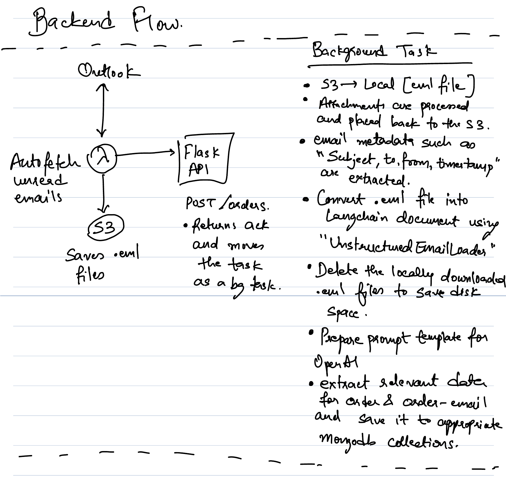

# Lighthouz AI Task

## Modules

- Some directories were used for initial testing rather than direct implementation on the APIs such as:
  - `openai-langchain`
  - `outlook-emails`
  - `data-extractor`

- `mock-emails` contains the scripts for generating dummy invoices with `faker` for testing.
- `backend` - Flask Based API Webserver
- `frontend` - ReactJS based frontend [I've used JS instead of Typescript since it was a task]

## Requirements Covered

- [ ] Lambda: Fetch Emails from Outlook and store the `.eml` files from Outlook APIs
- [x] Flask: Backend API to fetch the `.eml` files from S3 and process it using LangChain and extract info using OpenAI.
- [x] Flask: Store Details about the Order and Email threads in MongoDB.
- [x] Flask: GET APIs for fetching the Orders and Order Email Threads
- [x] React: Page for Listing all the Active Orders with relevant Details.
- [x] React: Page for Listing the specific Order details alongwith Email Threads.

## Flows

### Overall Flow

### Backend Flow

### Frontend Flow

## Some considerations which aren't covered

- Usage of SQS queue to handle the load on the API Server upon receiving a lot of emails.
- Offload the Background task to a different container/instance using either ECS tasks, Lambda, Celery, etc.
- Usage of Auth Tokens.
- Pydantic Models for the MongoDB collections to maintain schema, can also be versioned if needed.
- Can use Multi-modal models for non-searchable PDFs instead of current example.
- Detect `dispute/return/damage` sentiments from the Email body.
